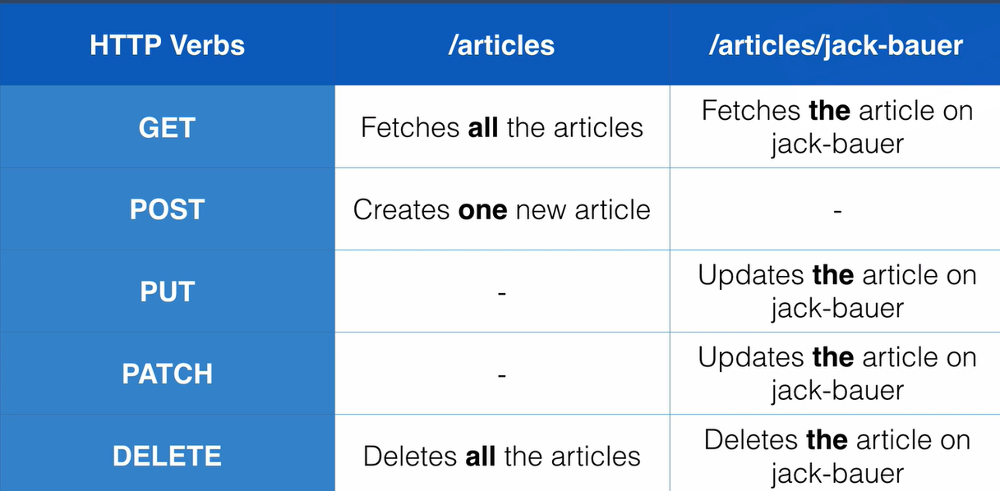

# 13. REST

## 13.1 What is RESTful API?
- RE: Representational
- S: State
- T: Transfer
- It is an architectural style for building APIs.
- Other examples: GraphQL, SOAP, FALCOR, etc.
- Most Important rules: 
  - Use HTTP request verbs.
  - Use specific pattern of routes/endpoint urls.
- HTTP request verbs:
  - GET, POST, PUT, PATCH, DELETE
- GET is equivalent to READ
- POST is equivalent to CREATE
- PUT/PATCH is equivalent to UPDATE.
- Difference between PUT/PATCH:
  - Using PUT, we update using entire new document to replace the previous one.
  - Using PATCH, we update only the broken parts.
  - `Think of Bicycle analogy.`
- DELETE is equivalent to DELETE.
- Specific Patterns of routes/endpoints:

## 13.2 Building our own RESTful API:
- First, we will create a database of articles.
- Create a app.js file with all the initialization.