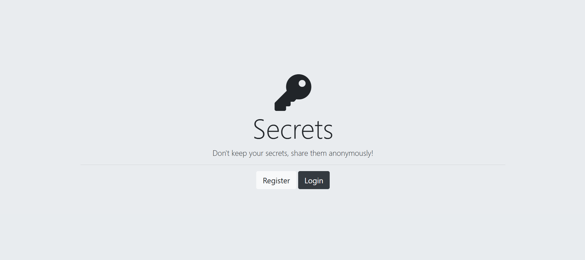
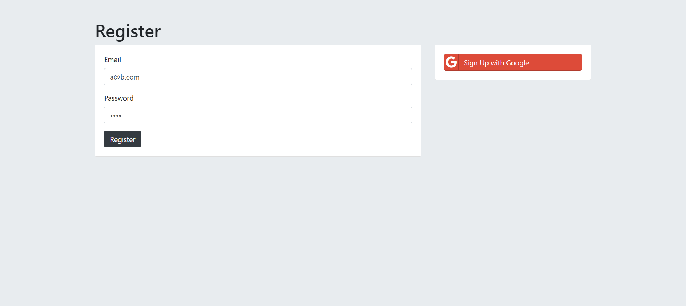
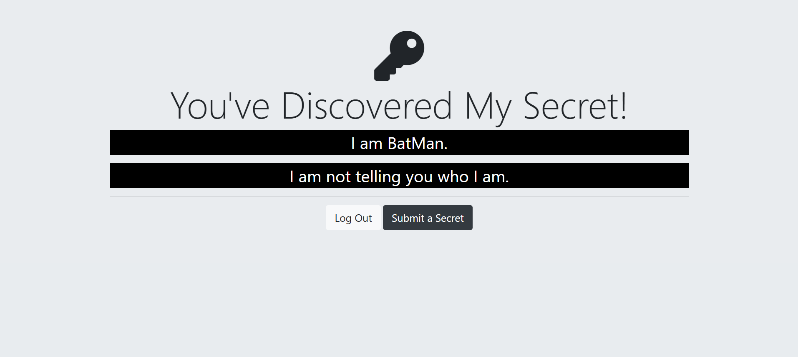
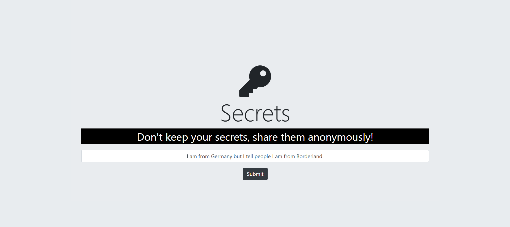
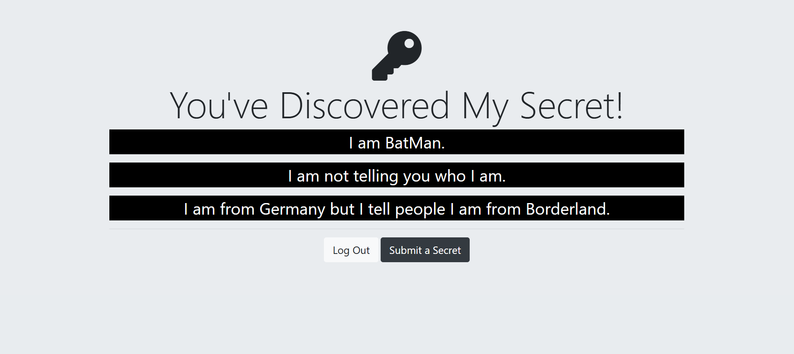

# Secrets
- This is a very simple application that lets users to create account and submit their secrets. 
- Only one secret per user is allowed.
- The authentication portion has been implemented using PassportJS.
- Users can also login/create their account using their google account.

## Screenshots
1. Home Page:

2. Login/Register: 

3. Secrets Page showing all the submitted secrets: 

4. Submit a Secret:

5. Secrets Page after submit: 

