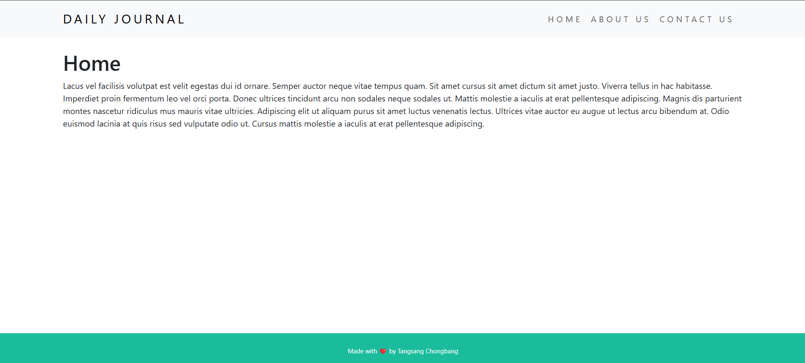

# A mini-blog site

This is a very simple and a very small project made using very basic Mongoose/MongoDB.

## Features
- Create Posts
- View Posts

# Setup
1. `git clone`
2. `npm install`
3. `node app.js`

# Screenshots

---

Made with ❤️ by Tangsang.

