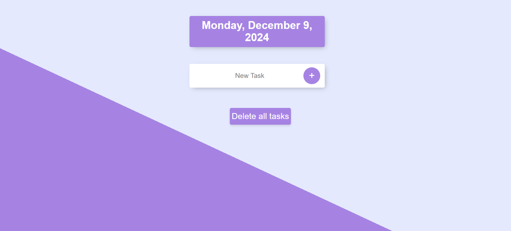
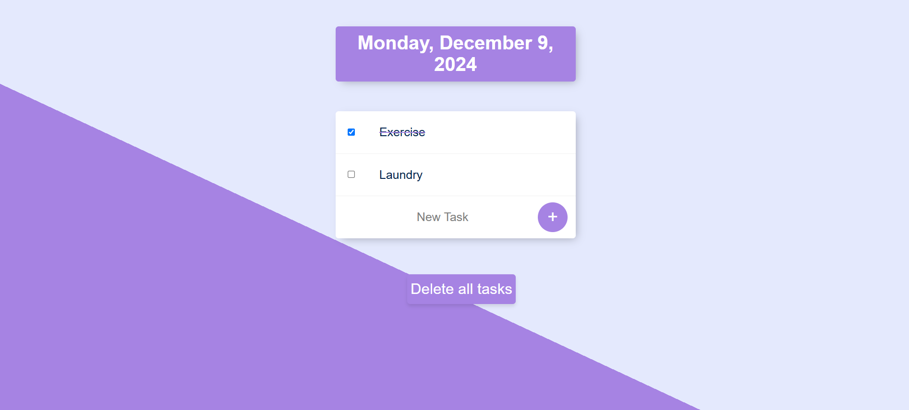
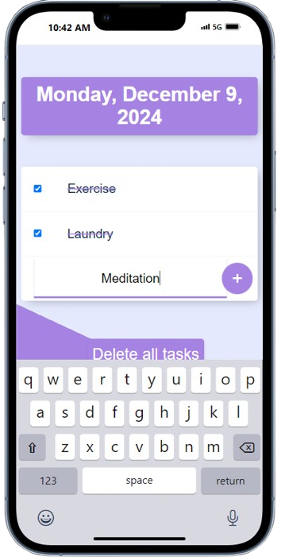
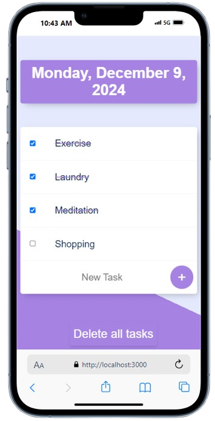

# To Do List App Version 1 📝
- This is a simple to-do-list project without any database.
- This has been built using HTML, CSS, JS, Express and EJS templating.

## Screenshots 📸

<em>Screenshot 1: On Desktop</em>

<em>Screenshot 2: On Desktop</em>

  
  

<em>Screenshot 3: On Phone</em>

